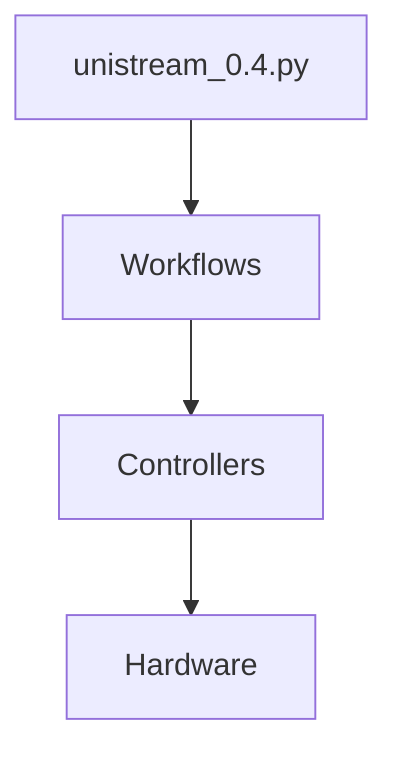

# Unistream Architecture Analyzer Skill

## Purpose

This skill analyzes the Unistream codebase architecture to:
1. **Map command flows** - Trace how commands flow through the layers (CLI → Workflows → Controllers → Hardware)
2. **Identify dependencies** - Build a dependency graph showing what imports what
3. **Suggest abstractions** - Recommend when to extract interfaces, abstract base classes, or separate concerns
4. **Detect violations** - Find architectural rule violations (e.g., GUI directly accessing hardware)

## When to Use This Skill

Invoke this skill when:
- User asks "how does X flow through the code?"
- User asks "where should I put this logic?"
- Planning refactoring or adding new features
- User asks "what depends on this file?"
- User says "help me abstract this"
- Reviewing architecture decisions

## Unistream Architecture Patterns

### Layer Structure
```
CLI (unistream_0.4.py)
  ↓
Workflows (src/workflows/*.py)
  ↓
Controllers (src/hardware/squid_adapter.py, etc.)
  ↓
Hardware (actual devices)
```

### Architecture Rules

**Rule 1: Layers must not skip levels**
- ❌ CLI directly accessing hardware controllers
- ❌ Workflows directly accessing device APIs
- ✅ Each layer only talks to the layer directly below

**Rule 2: Configuration is single source of truth**
- ❌ Hardcoded parameters anywhere
- ✅ All configuration from YAML files
- ✅ Hardware specs from configuration.ini

**Rule 3: Hardware context is singleton**
- ✅ Shared hardware state across workflows
- ❌ Multiple instances of hardware controllers
- ✅ Centralized resource management

**Rule 4: Coordinate transformations are centralized**
- ✅ All transformations through `precision_coordinate_transformer.py`
- ❌ Local coordinate calculations in multiple places
- ✅ Single source of pixel_size calculations

## What This Skill Analyzes

### 1. Import Graph
Shows which files import which files, creating a dependency map.

Example output:
```
unistream_0.4.py
├─ imports: src/workflows/scanning_workflow.py
│  ├─ imports: src/hardware/squid_adapter.py
│  │  ├─ imports: control.microcontroller
│  │  └─ imports: src/config/config_manager.py
│  └─ imports: src/core/data_manager.py
└─ imports: src/gui/main_window.py
```

### 2. Command Flow Tracing
Given a starting point (e.g., "scan tissue"), traces execution path.

Example:
```
User clicks "Start Scan" →
  main_window.py:start_scan_clicked() →
  scanning_workflow.py:execute() →
  squid_adapter.py:move_stage() →
  control.microcontroller.move_to()
```

### 3. Abstraction Opportunities
Identifies code that should be abstracted:

**Duplicate logic across files:**
```
Found 3 files calculating pixel_size_um:
- imaging_workflow.py:234
- polygon_alignment_workflow.py:89
- live_cutting_registration/coordinate_mapper.py:74

Suggestion: Extract to shared utility function
```

**God classes (too many responsibilities):**
```
annotation_manager.py has 2847 lines with:
- Polygon drawing logic
- Coordinate transformation
- File I/O
- GUI updates
- Export logic

Suggestion: Split into separate concerns:
- AnnotationRenderer (drawing)
- AnnotationExporter (I/O)
- CoordinateService (transformations)
```

**Missing interfaces:**
```
Multiple hardware controllers with similar methods:
- TecanPumpAdapter: start(), stop(), set_flow_rate()
- OpentronAdapter: start(), stop(), set_speed()

Suggestion: Create FluidicsDevice interface
```

### 4. Architecture Violations

Detects layer-skipping:
```
ERROR: GUI directly accessing hardware
File: src/gui/live_view_widget.py:456
Code: self.squid.camera.snap()
Fix: Call through workflow layer instead
```

Detects circular dependencies:
```
WARNING: Circular dependency detected
module_a.py → module_b.py → module_c.py → module_a.py
```

## How to Use This Skill

### Analyze Full Architecture
```bash
python analyze_architecture.py /path/to/unistream
```

### Trace Specific Command Flow
```bash
python analyze_architecture.py /path/to/unistream --trace "scan_tissue"
```

### Find Dependencies of a File
```bash
python analyze_architecture.py /path/to/unistream --deps src/workflows/scanning_workflow.py
```

### Suggest Abstractions for a File
```bash
python analyze_architecture.py /path/to/unistream --abstract src/core/annotation_manager.py
```

### Check for Architecture Violations
```bash
python analyze_architecture.py /path/to/unistream --check-rules
```

## Output Formats

### Dependency Graph (Mermaid)
Outputs a mermaid diagram you can visualize:


### Call Flow (Text)
```
scan_tissue()
  1. scanning_workflow.execute()
     └─ 2. squid_adapter.move_stage(x, y)
        └─ 3. microcontroller.move_to(x, y)
           └─ 4. Serial port write
```

### Abstraction Report (Structured)
```
File: src/core/annotation_manager.py
Lines: 2847
Complexity: High

Responsibilities:
- Drawing (lines 100-500)
- Export (lines 600-900)
- Transform (lines 1000-1300)
- GUI updates (lines 1400-2000)

Recommendation: Split into 4 classes
Priority: High
Estimated effort: 2-3 days
```

## Integration with Claude Code

When this skill is invoked:
1. Claude runs the analyzer on specified target
2. Interprets the output (dependency graph, flows, violations)
3. Provides actionable recommendations
4. Can generate refactoring plan if requested

## Customization

Edit `architecture_patterns.yaml` to:
- Define your project's layer structure
- Add custom architecture rules
- Specify naming conventions
- Define what constitutes "too large" for a file

## Example Queries

**"Where does the laser calibration flow through the code?"**
→ Traces from user action → workflow → controller → device

**"Should I put this pixel size calculation in coordinate_utils.py or annotation_manager.py?"**
→ Analyzes existing patterns and recommends based on Single Responsibility Principle

**"What would break if I change squid_adapter.py?"**
→ Shows all files that import and depend on it

**"Help me split annotation_manager.py into smaller pieces"**
→ Analyzes responsibilities, suggests split points, generates class structure
